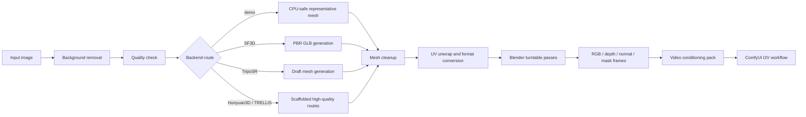
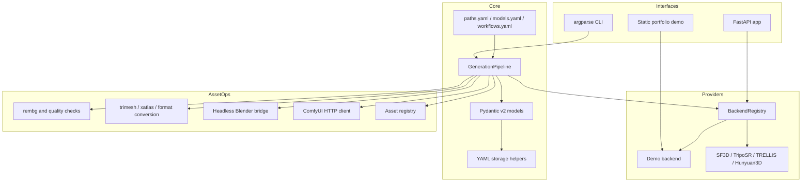
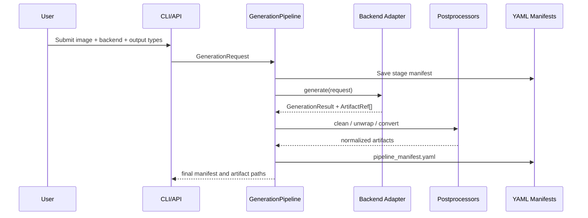
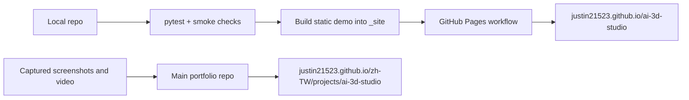
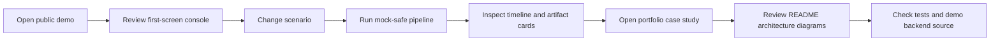

# AI 3D Studio

AI 3D Studio is a production-oriented Python framework for turning a single image into a Blender-ready 3D asset pipeline. It unifies multiple image-to-3D backends behind one contract, then adds preprocessing, mesh postprocessing, Blender render orchestration, ComfyUI workflow templates, and video-conditioning exports.

**Public demo:** https://justin21523.github.io/ai-3d-studio/  
**Portfolio case study:** https://justin21523.github.io/zh-TW/projects/ai-3d-studio/  
**Demo mode:** fully mock-safe. It exercises the CLI/API/pipeline artifact flow without GPU model weights, Blender, or ComfyUI.

## Interview Snapshot

| Area | What to notice |
| --- | --- |
| Product goal | One consistent interface for image-to-3D generation, asset cleanup, Blender rendering, and video-conditioning packs. |
| Core architecture | `BaseBackend` + `BackendRegistry` + typed Pydantic models + YAML manifests. |
| Stable demo path | `demo` backend generates deterministic GLB/OBJ/PLY artifacts on CPU for screenshots, smoke tests, and public demo. |
| Real model path | SF3D and TripoSR adapters are implemented; TRELLIS, Hunyuan3D, InstantMesh, CRM, Wonder3D, and Mesh2Splat are scaffolded. |
| Verification | `pytest`, API smoke, CLI smoke, static demo build, screenshot/video capture. |
| Deployment | Static GitHub Pages demo built from `demo/` source through GitHub Actions. |

## Demo First

The first viewport of the demo is the product console itself: scenario controls, backend selection, 3D preview, stage timeline, artifact tray, and manifest status.

```bash
python scripts/build_static_demo.py --out _site
python -m http.server 8080 --directory _site
```

Then open http://127.0.0.1:8080.

To regenerate portfolio media:

```bash
python scripts/capture_demo_media.py
```

Outputs:

| Asset | Path | Purpose |
| --- | --- | --- |
| Cover | `demo/media/cover.webp` | Portfolio card and video poster |
| Screenshot 1 | `demo/media/screenshots/01-demo-console-desktop.png` | First-screen product console |
| Screenshot 2 | `demo/media/screenshots/02-demo-completed-desktop.png` | Completed run state |
| Screenshot 3 | `demo/media/screenshots/03-demo-mobile.png` | Responsive mobile proof |
| Video | `demo/media/demo/demo-walkthrough.webm` | Short walkthrough for portfolio |

## System Flow



## Architecture



## Data Flow



## Deployment Model



## Module Organization

```mermaid
flowchart TB
    Root[ai3d package]
    Root --> Core[core: models, config, storage, logging]
    Root --> Backends[backends: demo, SF3D, TripoSR, scaffold routes]
    Root --> Pre[preprocessors: background removal, masking, quality]
    Root --> Post[postprocessors: mesh clean, UV unwrap, conversion]
    Root --> Blender[blender: subprocess bridge and render scripts]
    Root --> Comfy[comfyui: HTTP client, poller, workflow manager]
    Root --> Video[video: turntable and conditioning pack]
    Root --> Registry[registry: assets, models, workflows]
    Root --> Pipeline[pipeline: stage runner and batch orchestration]
    Root --> API[api: FastAPI routes]
    Root --> CLI[cli: command dispatcher]
```



## Feature Matrix

| Capability | Demo mode | Real local mode | Notes |
| --- | --- | --- | --- |
| CLI backend listing | Yes | Yes | `ai3d list-backends` |
| CPU-safe asset generation | Yes | Yes | `demo` backend produces representative mesh artifacts |
| SF3D / TripoSR inference | No | Yes, with source package and weights | Uses local GPU/PyTorch setup |
| Mesh cleanup | Yes | Yes | `trimesh` based |
| UV unwrap | Best effort | Yes, with `xatlas` | Texture baking is a later milestone |
| Blender turntable | Mocked in demo | Yes, with Blender installed | Subprocess-isolated |
| ComfyUI workflow orchestration | Mocked in demo | Yes, with ComfyUI running | Pure HTTP client |
| Public static demo | Yes | N/A | GitHub Pages |

## Quick Start

```bash
python -m pip install --upgrade pip
pip install -e .
pip install -r requirements.txt

python scripts/check_environment.py
python -m ai3d.cli.main list-backends
```

Run a mock-safe generation:

```bash
python - <<'PY'
from pathlib import Path
from PIL import Image

Path("/tmp/ai3d-demo").mkdir(exist_ok=True)
Image.new("RGB", (512, 512), (72, 145, 180)).save("/tmp/ai3d-demo/input.png")
PY

python -m ai3d.cli.main run-backend \
  --backend demo \
  --input /tmp/ai3d-demo/input.png \
  --output-dir /tmp/ai3d-demo/out \
  --output-type glb \
  --output-type obj
```

Run the mock-safe pipeline:

```bash
python -m ai3d.cli.main run-pipeline \
  --backend demo \
  --input /tmp/ai3d-demo/input.png \
  --output-dir /tmp/ai3d-demo/pipeline \
  --no-blender \
  --no-video-pack \
  --no-register
```

Start the API:

```bash
python -m uvicorn ai3d.api.app:app --host 127.0.0.1 --port 8765
curl http://127.0.0.1:8765/health
curl http://127.0.0.1:8765/api/v1/backends/
```

## Full Local Model Setup

Edit `configs/paths.yaml` to match your machine:

```yaml
ai_models_root: /mnt/c/ai_models
ai_tools_root: /mnt/c/ai_tools
outputs_root: /mnt/data/3d-studio/outputs
blender_executable: /usr/bin/blender
comfyui_base_url: http://127.0.0.1:8188
```

Model routes:

| Backend | Status | VRAM | Output | Best for |
| --- | --- | ---: | --- | --- |
| `demo` | Ready | 0 GB | GLB / OBJ / PLY | Public demo and smoke tests |
| `sf3d` | Implemented | 6 GB | PBR GLB / OBJ | Blender-ready textured assets |
| `triposr` | Implemented | 8 GB | Draft mesh / GLB / OBJ | Fast batch previews |
| `trellis` | Scaffold | 16 GB | GLB / 3DGS | Highest-quality future route |
| `hunyuan3d` | Scaffold | 24 GB | Textured mesh | ComfyUI Hunyuan3D workflow |
| `instantmesh` | Scaffold | 23 GB | Sparse-view mesh | LRM-style reconstruction |
| `crm` | Scaffold | 8 GB | Textured mesh | Lower-VRAM route |
| `wonder3d` | Scaffold | 16 GB | Multiview / normal maps | Ambiguous images |
| `mesh2splat` | Scaffold | 4 GB | PLY splat | Web 3DGS visualization |

## Testing

```bash
pytest -q
python -m compileall -q ai3d scripts tests
python scripts/build_static_demo.py --out _site
```

Expected public-demo smoke:

```bash
python -m ai3d.cli.main check-backend --backend demo
python -m ai3d.cli.main list-workflows
python scripts/check_environment.py
```

Environment checks may report missing Blender, ComfyUI, or model packages. That is acceptable for public demo mode and should be fixed only for real GPU inference.

## Demo Walkthrough For Interviewers



Recommended talking points:

| Talking point | Evidence |
| --- | --- |
| The demo does not fake external services | `demo` backend is clearly labeled mock-safe and emits deterministic artifacts. |
| The system is extensible | All backends implement the same `BaseBackend` interface. |
| Pipeline outputs are reviewable | `pipeline_manifest.yaml` and `demo_manifest.yaml` list artifacts and stage state. |
| Blender is isolated | The Blender bridge runs in a subprocess instead of importing `bpy` into the PyTorch process. |
| ComfyUI integration is lightweight | The client uses HTTP requests and workflow templates. |

## Repository Map

```text
ai3d/
  api/              FastAPI app and routes
  backends/         Demo, implemented, and scaffolded backend adapters
  blender/          Headless Blender bridge and scripts
  cli/              argparse command surface
  comfyui/          HTTP client and workflow tools
  core/             Pydantic models, config, paths, storage
  pipeline/         11-stage orchestration and batch runner
  postprocessors/   mesh cleanup, UV unwrap, format conversion
  preprocessors/    background removal, quality checks, masking
  registry/         YAML-backed asset/model/workflow registries
  video/            turntable and conditioning-pack exports
demo/               static showcase app and generated media
docs/               technical deep dives
workflows/          ComfyUI workflow templates
tests/              pytest suite
```

## Current Risks And Boundaries

| Risk | Mitigation |
| --- | --- |
| Real inference needs local model source packages and weights | Keep demo backend available for public proof; document model setup separately. |
| Blender may be unavailable in CI or reviewer machines | Public demo does not require Blender; real mode reports availability explicitly. |
| ComfyUI is an external runtime | Demo uses static representative workflow data; real mode checks HTTP connectivity. |
| Scaffolded backends are not full inference implementations yet | Capability status and roadmap identify what is complete vs planned. |

## Roadmap

| Milestone | Scope |
| --- | --- |
| M1 | SF3D + TripoSR adapters, Blender bridge, ComfyUI client, video pack, tests, demo backend |
| M2 | Full TRELLIS, Hunyuan3D, InstantMesh, CRM inference routes and texture baking |
| M3 | Wonder3D, Mesh2Splat, 3DGS pipeline, EXR depth sequence exports |
| M4 | Async FastAPI jobs, benchmark dashboard, production queue integration |

